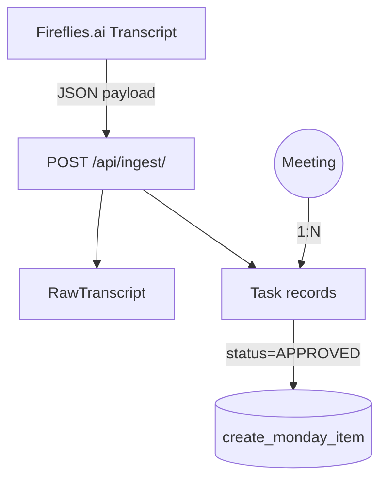

# Architecture

## Apps & Modules

1. **tasks** – owns models, admin, serializers, views, and a `services.py` layer.
2. **taskforge** – project settings, top-level URLs, global error handlers.
3. **tests** – pytest test-suite providing unit & integration coverage.

## Core Models
| Model | Purpose |
|-------|---------|
| Meeting | Metadata about each Fireflies call |
| RawTranscript | Stores full transcript JSON (lazy-loaded in admin) |
| Task | Single action item extracted by n8n; may be auto-approved |
| ReviewAction | Human decision (approve / reject / edit) |
| AppSetting | Ops-editable key/value store (e.g. MONDAY_API_KEY) |

## Data-flow
1. **Ingestion**: n8n sends Fireflies output to `/api/ingest/`.
2. **Review**: Staff browse `ActionItem` proxy model in Django admin.
3. **Sync**: Approved tasks are posted to Monday.com (stubbed; see `services.create_monday_item`).

## Settings Philosophy
* `DEBUG=True` everywhere per stakeholder request.
* Works on SQLite (`db.sqlite3`) by default; uses `DATABASE_URL` env var on Railway. 